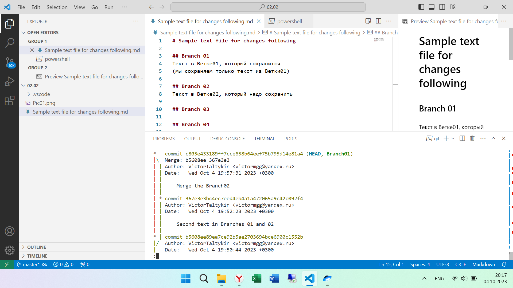
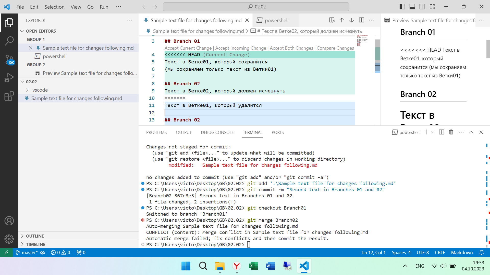
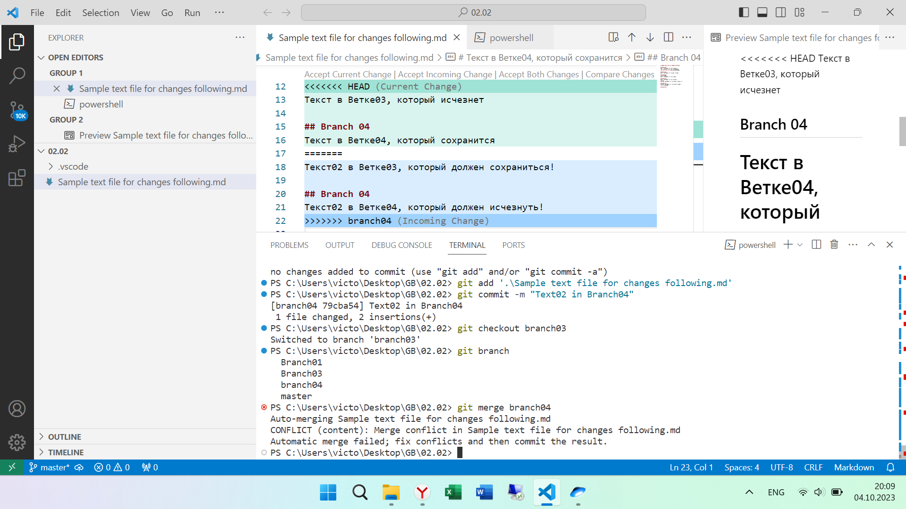

# Sample text file for changes following
Final Conflict
we add both changes

Вторая строк для простого слияния

## Branch 01
Текст в Ветке01, который сохранится
(мы сохраняем только текст из Ветки01):

## Branch 02
Текст в Ветке02, который надо сохранить

## Branch 03
Текст02 в Ветке03, который должен сохраниться!

## Branch 04
Текст02 в Ветке04, который должен исчезнуть! (Всё правильно, в данном случае мы приняли все изменения, которые были в Ветке04, а не выбирали, как в первом случае)

